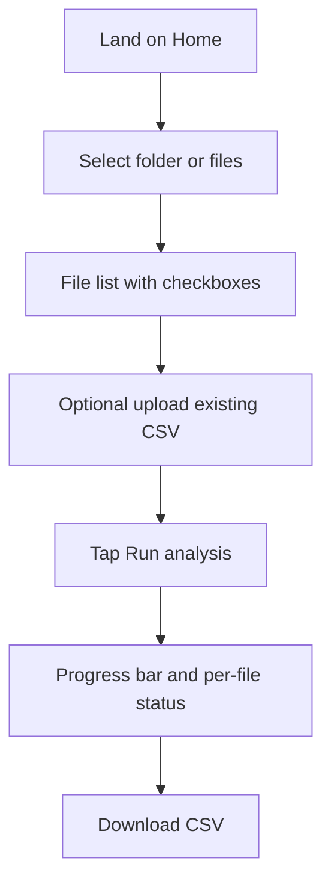
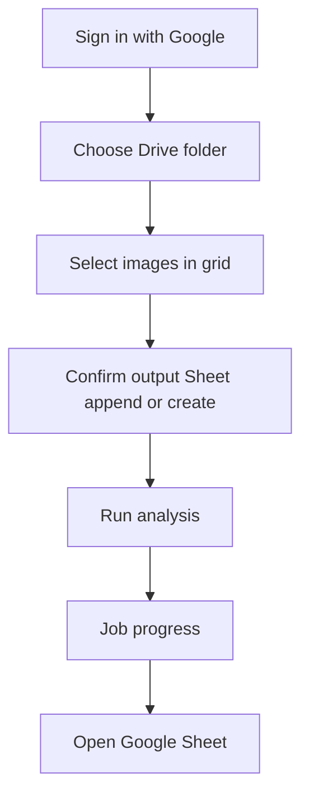
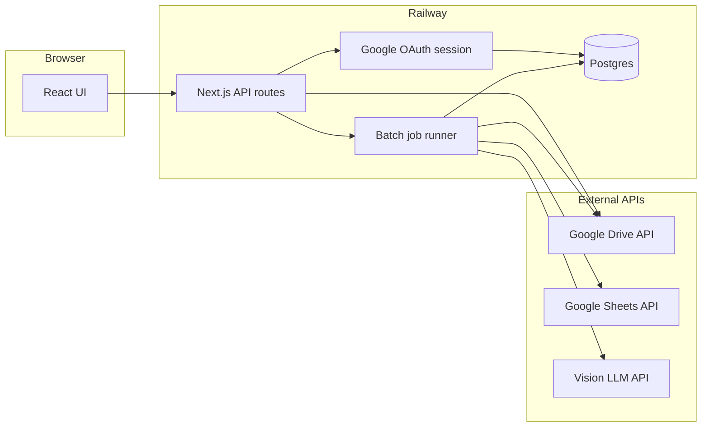
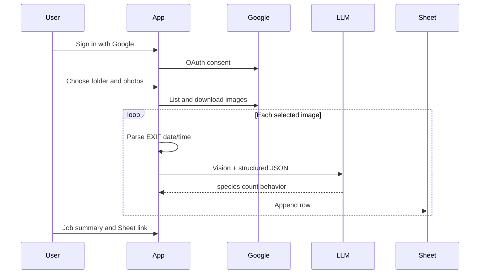

# Camera Trap Photo Analyzer

## What this app does

**Camera Trap Photo Analyzer** helps researchers and field teams turn **camera-trap photos** into a **structured wildlife log** (spreadsheet). For each image, the app records **when** the photo was taken, **what species** appeared (common name only), **how many** individuals, and **what they were doing** (foraging, moving, standing, etc.). Empty frames and human detections are handled with explicit rules.

**Today (local MVP):** User picks photos from their computer → AI analyzes each image → user **downloads a CSV** (or appends to an existing log file).

**Planned (full product):** User signs in with Google → picks a **Drive folder** of trap images → AI analyzes → results **append to a Google Sheet** in the same folder (create sheet if none exists).

**Context:** Forest camera traps (e.g. India); primary subjects are wild animals; humans and blank triggers are common edge cases.

---

## Product & screens (for Stitch / UI design)

Use this section to design screens in [Stitch](https://stitch.withgoogle.com). It describes **intent**, **flows**, and **UI building blocks** for both the **current single-page app** and the **planned multi-step product**.

### Problem and user goal

| | |
|---|---|
| **User** | Ecologist, forest officer, or volunteer managing trap SD cards / Drive folders |
| **Pain** | Hundreds of photos; manual review is slow and inconsistent |
| **Goal** | One row per photo in a sheet with species, count, behavior, and timestamp |
| **Success** | Batch run completes; log is append-only and reusable for the next card dump |

### Core capabilities

1. **Ingest** — Many trap images at once (folder or multi-select).
2. **Analyze** — Vision AI per image (server-side); date/time from photo metadata, not from AI.
3. **Export** — Tabular log with fixed columns; **append** to existing log when one already exists.
4. *(Planned)* **Google Drive** — Browse folder, thumbnails, select subset; write to Sheet in Drive.
5. *(Planned)* **Sign-in** — Google OAuth; no anonymous access in production.

### Screen map

| Screen | Status | Purpose |
|--------|--------|---------|
| **Home / Analyze** | Built (local MVP) | Single scrollable page: pick files, optional CSV, run job, progress, download |
| **Sign in** | Planned | Google OAuth; explain Drive + Sheets permissions |
| **Dashboard / Select from Drive** | Planned | Paste or browse folder ID; grid of images with checkboxes and thumbnails |
| **Output target** | Planned | Show resolved Sheet (append vs new); optional override picker |
| **Job progress** | Partial (section on Home today) | Per-file status; overall progress; errors; link to Sheet or download |
| **Job complete / Summary** | Partial | Download CSV or “Open in Google Sheets”; filename used; error list |

**MVP is one screen** with three numbered sections. **Full product** likely splits Drive browse and progress into dedicated screens or a wizard.

### User flow — local MVP (design now)



### User flow — full product (design target)



### Screen spec: Home / Analyze (current UI)

**Layout:** Single column, max width ~900px, centered. Dark forest-themed palette (dark background `#0f1410`, cards `#1a221c`, accent green `#5cb87a`).

| Zone | Content | Components |
|------|---------|------------|
| **Header** | Title + one-line subtitle | `H1` “Camera Trap Analyzer”; subtitle explains local MVP or product tagline |
| **Global error** | Validation / API errors | Banner (red border); e.g. max 50 files, missing API key, HEIC rejected |
| **Section 1 — Select images** | Ingest | Section card; labels “Folder” and “Or individual files”; native file inputs; hint text (formats, max 50); toolbar: Select all, Deselect all, Remove selected; scrollable **file list** (checkbox + filename); counter “N of M selected” |
| **Section 2 — Optional log** | Append mode | Section card; CSV file input; hint “Will append to: {filename}” when chosen |
| **Section 3 — Run analysis** | Action + feedback | Primary button “Run analysis” (disabled when 0 selected or running); label changes to “Running…”; secondary **Download {filename}** when ready; **progress bar** + “completed / total”; **status list** per file |

**Per-file status labels (use color in design):**

| Status | Label | Meaning |
|--------|-------|---------|
| `pending` | Pending | Queued |
| `analyzing` | Analyzing… | LLM in progress |
| `done` | Done | Row written |
| `error` | Error | Failed; show message after filename |

**Primary actions**

| Button | State | Action |
|--------|-------|--------|
| Run analysis | Enabled when ≥1 file selected and idle | Starts batch |
| Run analysis | Disabled | No selection or job running |
| Download …csv | Visible when job completed | Downloads result file |

**Empty states**

- No files yet: only file inputs and format hint (no list).
- No optional CSV: section 2 still visible with explanation of append behavior.

**Copy suggestions for Stitch**

- Title: **Camera Trap Analyzer**
- Subtitle (MVP): “Select trap photos, analyze with AI, download your wildlife log.”
- Subtitle (product): “Connect Google Drive, analyze trap photos, update your spreadsheet automatically.”
- Section titles: “1. Select images”, “2. Optional existing log (append)”, “3. Run analysis”
- Primary CTA: **Run analysis**
- Secondary CTA: **Download Camera_Trap_Analysis_YYYY-MM-DD.csv**

### Screen spec: Dashboard / Drive (planned)

| Zone | Content |
|------|---------|
| Folder input | URL or ID of Drive folder containing trap images |
| Image grid | Thumbnail, filename, checkbox; Select all; filter hint e.g. `IMG_*` |
| Sheet resolver | “Appending to: {sheet name}” or “Will create: Camera_Trap_Analysis_{date}”; optional “Choose different sheet” |
| CTA | **Run analysis** (same job model as MVP) |

### Output table (design data grid / Sheet preview)

Each analyzed photo becomes **one row**. Designers can mock this as a table or Google Sheet.

| Column | Example | Notes |
|--------|---------|-------|
| Photo name | `IMG_0421.JPG` | Filename |
| Date | `2026-03-15` | From EXIF; not AI |
| Timestamp | `04:32:11` | 24h |
| Species | `Sambar deer` or `Empty trail - vegetation only` | Common name only; scene description if no animal |
| # Individuals | `2` or `0` | Integer |
| Behavior | `moving` or `N/A` | Enum: foraging, moving, standing, resting, drinking, running, unknown, N/A |

**Business rules for content design**

- No animal → Species = short scene description; Behavior = **N/A**; count = **0**.
- Humans → Species = **Human** (optionally “Human (N individuals)”).
- Unclear → Species = **Unidentified**; avoid rare-species guesses.

### Error and edge cases (include in prototypes)

- More than 50 files selected → blocking message.
- HEIC / HEIF uploaded → reject with clear message (MVP).
- Missing OpenAI key (dev) → “API key not configured” on run.
- Partial batch failure → some rows Done, some Error; job can still complete with downloadable CSV for successes.
- Append CSV with wrong header → job failed; banner with parse error.

### Design notes

- **Tone:** Field research / conservation; calm, readable, not playful.
- **Density:** One main task per screen section; progress visible during long batches.
- **Accessibility:** Progress bar with `aria-valuenow`; status not color-only (text labels).
- **Future auth screen:** Trust copy for Google scopes (read photos, edit spreadsheet).

---

## Path A (current) — local MVP enhancements

| Feature | Status |
|---------|--------|
| HEIC / HEIF upload (server converts to JPEG) | Done |
| Thumbnails + click row to **preview** image and results | Done |
| **Log Library** (browser localStorage, up to 30 runs) | Done |
| **Empty-frame skip** (no LLM on uniform frames) | Done |
| **Burst deduplication** (shots within 2s share one LLM call) | Done |
| Railway deploy config (`railway.toml`, `/api/health`) | Done |

Optional env: `SKIP_EMPTY_FRAMES`, `EMPTY_STDEV_THRESHOLD`, `BURST_GAP_MS`, `DEDUPE_BURST` — see [.env.example](.env.example).

### Host on Railway

1. Push this repo to [GitHub](https://github.com/rajeshpclearning-sudo/cameratrapanalyzer).
2. Open [railway.app](https://railway.app) → **New Project** → **Deploy from GitHub repo** → select `cameratrapanalyzer`.
3. Set **Variables** on the `cameratrapanalyzer` service (copy values from `.env.local`):

   | Variable | Value |
   |----------|--------|
   | `OPENAI_API_KEY` | Your OpenRouter `sk-or-v1-...` key |
   | `OPENAI_BASE_URL` | `https://openrouter.ai/api/v1` |
   | `LLM_MODEL` | `openai/gpt-4o-mini` |
   | `OPENROUTER_SITE_URL` | `https://cameratrapanalyzer-production.up.railway.app` (your public domain) |

   **CLI (after `railway login` and `railway link` in this repo):**
   ```bash
   ./scripts/railway-sync-env.sh
   railway redeploy
   ```

   Optional: `LLM_CONCURRENCY=2`, `SKIP_EMPTY_FRAMES=true`, `BURST_GAP_MS=2000`
4. **Settings** → **Networking** → **Generate domain** (e.g. `*.up.railway.app`).
5. Open the public URL — health check: `https://YOUR-DOMAIN/api/health`

#### Service shows “Online” but you don’t see a website

Railway’s project canvas only shows a green **Online** badge on the service card — it does **not** show your public URL until you add one.

1. Click the **cameratrapanalyzer** service (not just the project background).
2. Open the **Settings** tab (gear icon in the left sidebar for that service).
3. Scroll to **Networking** → **Public Networking**.
4. Click **Generate Domain** (or **+ Domain**). Copy the `something.up.railway.app` link.
5. Open that URL in a new browser tab. You should see **WildEye Analyzer**. Test: `https://YOUR-DOMAIN/api/health` → `{"ok":true}`.
6. If the domain returns **502** or a blank page: open **Deployments** → latest deploy → **View logs**. Fix build errors, ensure `OPENAI_API_KEY` is set, then **Redeploy**.

#### Page looks unstyled (plain white/grey, visible “Choose Files” buttons)

The HTML is loading but **CSS is not**. You’ll see default browser fonts and native file pickers instead of the dark WildEye layout.

1. **Local:** stop the dev server, then run:
   ```bash
   rm -rf .next node_modules
   npm install
   npm run dev
   ```
   Open http://localhost:3000 and hard-refresh (**Cmd+Shift+R** on Mac).
2. Confirm `npm install` finishes without errors and that `node_modules/tailwindcss` exists.
3. In the browser **Network** tab, check that `/_next/static/css/*.css` returns **200** (not 404).
4. **`nextjs-portal` in the DOM** is only the Next.js dev overlay in development — it is not an error and can be ignored.

#### “Run Analysis” fails (e.g. “string did not match the expected pattern”)

That Safari message usually means the server returned a **non-JSON error** (often HTTP 500 with an empty body). Common causes:

1. **`OPENAI_API_KEY` missing** in Railway **Variables** — add it and redeploy.
2. **`sharp` / image processing** on Linux — use `npm run start` (not standalone `server.js`) and keep `outputFileTracingIncludes` for `sharp` in `next.config.ts` (already in repo).
3. Check **Deploy logs** while clicking Run Analysis; look for `sharp` or `OPENAI` errors.

**CLI (optional):** `brew install railway`, `railway login`, `railway link`, `railway up`, then set variables in the dashboard.

Note: Job progress is stored in memory (single instance). Restarts clear in-flight jobs.

---

## Local MVP — developer setup

Runnable **local flow** — no Google sign-in, no app login. Pick images on your machine, analyze via OpenAI, download (or append to) a CSV. Optionally copy each new analysis row to your personal **Supabase** database (server-side only; see below).

### Prerequisites

- Node.js 18+
- [OpenAI API key](https://platform.openai.com/api-keys)

### Setup

```bash
cd "Camera Trap Cursor"
npm install
cp .env.example .env.local
# Edit .env.local and set OPENAI_API_KEY=sk-...
npm run dev
```

Open [http://localhost:3000](http://localhost:3000).

### Troubleshooting local dev

If the page shows a **Runtime Error** (for example React error #299 or a webpack crash), the dev cache is often stale — especially after running `npm run build` while `npm run dev` is still running.

1. Stop the dev server (`Ctrl+C` in the terminal).
2. Clear the cache and restart:

```bash
npm run dev:clean
```

3. Hard-refresh the browser (`Cmd+Shift+R` on Mac, `Ctrl+Shift+R` on Windows).
4. If the error persists only in Cursor’s built-in browser, try **Chrome or Safari** — some browser extensions inject scripts that can trigger React #299 on a broken page.

### Usage

1. **Select images** — folder picker or individual files (JPEG, PNG, WebP, HEIC; max 50 per batch). Click a row to preview.
2. **Optional existing log** — upload a `Camera_Trap_Analysis*.csv` to **append** new rows (header must match spec below).
3. **Run analysis** — progress per file; uses EXIF for date/time when available. After a batch finishes, **upload more photos** in the same session — new uploads are auto-selected, already-analyzed photos are skipped, and **Analyze N new photo(s)** only processes waiting rows; results append to the session CSV (and Supabase when configured). Use **Clear results & re-analyze all** only to wipe session memory and rerun everything.
4. **Download CSV** — new file `Camera_Trap_Analysis_YYYY-MM-DD.csv`, or same name as the uploaded log when appending.
5. **Optional Supabase** — when configured, each **newly analyzed** row in a finished job is inserted into `camera_trap_sightings` (rows from an uploaded existing CSV or earlier session rows are not re-inserted).

### Optional: Supabase backup (personal, no login)

No sign-in in the app. Your Next.js server writes to Supabase using a secret key in `.env.local`.

**Option A — from Cursor (Supabase MCP):**

1. Create a [personal access token](https://supabase.com/dashboard/account/tokens) (one-time “login” for Cursor — not your app).
2. **Cursor → Settings → MCP → supabase** — if you see `SUPABASE_ACCESS_TOKEN`, paste the `sbp_...` token there. Toggle **supabase** off, then on. Fully restart Cursor if tools still say Unauthorized.
3. Ask the agent: *Create project camera-trap in Mumbai and run supabase/schema.sql.*

**MCP looks green but tools fail?** The server can run without a valid token. The green dot only means the MCP process started; Supabase API calls need the `sbp_...` token in that server’s env (step 2).

**Option B — one command:**

```bash
# Token from https://supabase.com/dashboard/account/tokens
SUPABASE_ACCESS_TOKEN=sbp_... npm run setup:supabase
```

Creates project `camera-trap` in Mumbai (`ap-south-1`) and runs [`supabase/schema.sql`](supabase/schema.sql).

**Option C — Supabase website:**

1. Create a free project at [supabase.com](https://supabase.com).
2. Open **SQL Editor** → **New query**, paste the contents of [`supabase/schema.sql`](supabase/schema.sql), and **Run**.
3. Copy two values into `.env.local` (see below — Supabase moved them in the dashboard).
4. Restart `npm run dev`.
5. Run an analysis. In Supabase **Table Editor → camera_trap_sightings**, you should see one row per newly analyzed photo.

Columns match the CSV: photo name, date, time, species, individual count, behavior, plus `job_id` and `created_at`. If env vars are missing, the app works as before (CSV only).

#### Where to find URL and secret key (camera-trap project)

**A — Project URL**

1. In the left sidebar, click **Settings** (gear icon).
2. Click **General** (under Configuration).
3. Find **Project URL** (looks like `https://something.supabase.co`).
4. Paste into `.env.local` as `SUPABASE_URL=...`

Shortcut: while in your project, the browser address bar often looks like `.../project/abcdefghij.../` — your URL is `https://abcdefghij.supabase.co` (same `abcdefghij` as in that link).

**B — Secret key for the app** (server writes rows; never put in the browser)

On **Settings → API Keys** you may see two tabs:

| Tab | What to use |
|-----|-------------|
| **Publishable and secret API keys** (default) | Under **Secret keys**, open **default** → click the **eye** icon → copy the key starting with `sb_secret_...` |
| **Legacy anon, service_role API keys** | Copy **service_role** (long key starting with `eyJ...`) |

Put either secret key in `.env.local` as `SUPABASE_SERVICE_ROLE_KEY=...` (the variable name is legacy; `sb_secret_...` works too).

Do **not** use the **publishable** key (`sb_publishable_...`) — that one is for browsers only.

**Security:** Never commit these keys to git. Personal use only — RLS is disabled on this table.

### CSV columns

`Photo name,Date,Timestamp,Species,# Individuals,Behavior`

- **No animal:** describe scene in Species; Behavior `N/A`; count `0`.
- **Humans:** Species `Human`; appropriate behavior.
- See [Google Sheet output](#google-sheet-output) for full rules (same semantics as future Sheets export).

### API (for reference)

| Method | Path | Purpose |
|--------|------|---------|
| `POST` | `/api/jobs` | `multipart/form-data`: `files[]`, optional `existingCsv` |
| `GET` | `/api/jobs/[id]` | Poll job status |
| `GET` | `/api/jobs/[id]/download` | Download CSV when complete |

### Optional env

- `LLM_CONCURRENCY` — parallel LLM calls (default `2`)
- `SUPABASE_URL` / `SUPABASE_SERVICE_ROLE_KEY` — optional; persist new analysis rows to Supabase (see above)

### Cursor agent skills

Project skills live in `.cursor/skills/`. **`sync-readme-on-change`** requires the agent to update this README whenever other project files change (same session). Attach or mention that skill when using Cursor on this repo.

---

## Future: hosted + Google Drive (planned)

Hosted app on **Railway** with Google OAuth, Drive folder browse, and Sheets append/create in folder. Spec below.

**Status:** Local MVP implemented; Google/Railway integration not started.

---

## Goal (full product)

Record what animals (or humans) crossed the camera trap by analyzing trap photos and logging structured rows in a spreadsheet.

1. Sign in with Google (OAuth).
2. Browse a Google Drive folder and select one or more images.
3. Analyze each selected image with a vision LLM (server-side).
4. Append one row per image to a Google Sheet.

**Primary context:** Forest camera traps in India; expect wildlife. Handle humans, empty frames, and vegetation explicitly.

---

## Google Sheet output

### Columns

| Column | Source |
|--------|--------|
| Photo name | Drive file name |
| Date of image | EXIF `DateTimeOriginal` (preferred), else Drive `imageMediaMetadata.time`, else filename parsing — **not from LLM** |
| Timestamp | Time portion from the same source as date (`HH:MM:SS`, 24h) |
| Species name | LLM — **common name only** (no scientific names) |
| Number of individuals | LLM (integer; `0` if none) |
| Behavior | LLM: `foraging`, `moving`, `standing`, `resting`, `drinking`, `running`, `unknown`, etc. |

**Header row (frozen):**  
`Photo name | Date | Timestamp | Species | # Individuals | Behavior`

Optional later columns: `Job ID`, `Analyzed at`, `Confidence`, `Notes`, `Drive file link`.

### Rules (from project requirements)

- **No animal:** Describe the photograph under **Species** (e.g. `Empty trail - vegetation only`). Set **Behavior** to `N/A` and **# Individuals** to `0`.
- **Humans:** Species = `Human` (or `Human (N individuals)`); behavior as appropriate.
- **Unclear / blurry:** Species = `Unidentified`; avoid guessing rare species.
- **Append-only** — each run adds rows; do not overwrite prior surveys.

**Which spreadsheet to use** — See **Output location** below.

### Output location (same folder as photos)

**Default behavior — append if a sheet exists, otherwise create:**

1. After the user picks a source folder, the app lists Google Sheets in that folder whose names match `Camera_Trap_Analysis*` (prefix match).
2. **If one or more match** — append new rows to the **most recently modified** sheet (one continuous log per folder).
3. **If none match** — auto-create `Camera_Trap_Analysis_YYYY-MM-DD` in that folder, write the header row, then append analysis rows.

**Optional override (UI):** User can pick a different spreadsheet in the folder before running a job; that choice applies to that run only.

**If multiple sheets match and the user does not override:** use the most recently modified sheet and show which sheet was selected in the job summary.

---

## Architecture



**Client / server split**

- OAuth tokens and LLM API keys **never** run in the browser.
- Drive listing, download, EXIF parsing, LLM calls, and Sheet writes run **server-side** after the user selects files.

### Tech stack

| Layer | Choice |
|-------|--------|
| Hosting | [Railway](https://railway.app) — Web Service + PostgreSQL |
| Framework | Next.js (App Router), `output: "standalone"` |
| UI | React (e.g. shadcn/ui) — folder picker, thumbnails, multi-select, job progress |
| Google APIs | `googleapis` (Node) — Drive + Sheets |
| EXIF | `exifr` or `sharp` metadata |
| LLM | OpenAI GPT-4o **or** Google Gemini (vision); one provider via env var |
| Database | Railway Postgres + Prisma — users, OAuth tokens, jobs, job items |

---

## User flow

1. **Sign in** — Google OAuth scopes:
   - `https://www.googleapis.com/auth/drive.readonly`
   - `https://www.googleapis.com/auth/spreadsheets`
2. **Source folder** — User pastes a Drive folder URL/ID; app lists images (`image/jpeg`, `image/png`; HEIC in a later phase).
3. **Select images** — Checkbox grid with thumbnails; “Select all”; optional name filters (e.g. `IMG_*`).
4. **Output** — Resolve target Sheet (append to existing `Camera_Trap_Analysis*` in folder, or auto-create); optional manual Sheet override.
5. **Run analysis** — Background job with per-file progress; resumable on failure.
6. **Review** — Link to Sheet + per-image errors.



---

## LLM analysis

### Structured response (example)

```json
{
  "species_common": "Sambar deer",
  "individual_count": 2,
  "behavior": "moving",
  "has_animal": true,
  "has_human": false,
  "notes": ""
}
```

Use JSON schema / structured output (OpenAI `json_schema` or Gemini JSON mode).

### Prompt guidelines

- Forest camera trap; **common English names** only.
- Count **visible** individuals only.
- Behavior enum: `foraging`, `moving`, `standing`, `resting`, `drinking`, `running`, `unknown`, `N/A`.
- **Do not** ask the LLM for date or time — use EXIF and Drive metadata only.
- Resize/compress images before the API call (see token savings below).

### Idempotency (Phase 2)

Store `fileId + modifiedTime`; skip or offer re-analyze for unchanged files.

---

## Reducing LLM token usage

| Area | Tactics |
|------|---------|
| **Image** | Resize to 768–1024px long edge; JPEG ~80–85%; OpenAI `detail: "low"` when subject is large; burst dedup (Phase 2); ROI crop / empty-frame skip (Phase 2) |
| **Prompt** | Short system prompt; JSON-only reply; no date/time in prompt |
| **Workflow** | User multi-select only; cache by file ID; cheaper model for triage (Phase 2); batch APIs for overnight jobs |
| **MVP** | Resize + JPEG, short prompt, EXIF-only datetime, multi-select |

Rough savings: downscaling 50–80% image tokens; skipping empty frames 30–70% fewer calls; burst dedup 20–50% fewer calls.

---

## Railway deployment

### Services

- **Web** — Next.js from GitHub (Nixpacks or `railway.toml` / optional `Dockerfile` for `sharp`).
- **PostgreSQL** — Official Railway Postgres linked to the web service (`DATABASE_URL` auto-injected).

### Postgres options

| Option | When to use |
|--------|-------------|
| **Railway PostgreSQL** (recommended) | MVP — tokens, jobs, progress. **Postgres 16**, pinned major version. |
| **Railway PostgreSQL HA** | Production failover; optional later. |
| **External Postgres** (Neon, Supabase) | DB separate from Railway; set `DATABASE_URL` manually. |
| **Marketplace** (pgvector, PostGIS, Timescale) | Not needed for v1. |

### Build and run

- `next.config.js`: `output: "standalone"`.
- Build: `npm run build` (+ `prisma generate`).
- Start: `node .next/standalone/server.js`.
- Migrations: `npx prisma migrate deploy` on deploy (release command or Railway shell).

### Environment variables

| Variable | Purpose |
|----------|---------|
| `DATABASE_URL` | From Postgres plugin |
| `AUTH_SECRET` | Session encryption |
| `GOOGLE_CLIENT_ID` / `GOOGLE_CLIENT_SECRET` | OAuth |
| `NEXTAUTH_URL` | e.g. `https://<service>.up.railway.app` |
| `OPENAI_API_KEY` or `GEMINI_API_KEY` | Vision LLM |
| `SUPABASE_URL` / `SUPABASE_SERVICE_ROLE_KEY` | Optional: persist analysis rows to external Supabase |

### OAuth redirect (Google Cloud Console)

`https://<your-service>.up.railway.app/api/auth/callback/google`  
(or your custom domain). Use a custom domain before moving OAuth consent to **Published**.

---

## Prerequisites (before implementation)

1. **Google Cloud** — Drive API + Sheets API enabled; OAuth web client; consent screen (Testing → Published when ready).
2. **LLM provider** — OpenAI or Gemini API key.
3. **Railway account** — GitHub-connected project: Web Service + **Railway PostgreSQL (Postgres 16)**.
4. **Domain** (optional) — Custom domain on Railway for stable production OAuth.

---

## Google Cloud setup checklist

1. Create GCP project; enable **Google Drive API** and **Google Sheets API**.
2. Configure OAuth consent screen and scopes (see User flow).
3. Create **OAuth 2.0 Client ID (Web)** with Railway redirect URI.
4. Deploy to Railway; set environment variables; run Prisma migrations.

---

## Planned project structure

```
├── app/
│   ├── page.tsx                    # Landing + sign-in
│   ├── dashboard/page.tsx          # Folder browse + select + run
│   └── api/
│       ├── auth/[...]/route.ts
│       ├── drive/folders/route.ts
│       ├── drive/files/route.ts
│       ├── jobs/route.ts
│       └── jobs/[id]/route.ts
├── lib/
│   ├── google.ts
│   ├── exif.ts
│   ├── llm/analyze.ts
│   ├── supabase.ts               # Optional Supabase client (server)
│   ├── persist-sightings.ts      # Insert analysis rows after jobs
│   ├── sheets.ts                 # Resolve append vs create, append rows
│   └── jobs.ts
├── supabase/schema.sql           # One-time table setup for optional backup
├── prisma/schema.prisma
├── railway.toml
└── .env.example
```

---

## Phased delivery

### Phase 1 — MVP

- Google sign-in; Drive folder listing; multi-select images
- EXIF date/time; LLM analysis; append-or-create Sheet in same folder
- Job progress UI

### Phase 2 — Operations

- Skip already-analyzed files (same Sheet, by Drive file ID)
- Job log; retry failed images only
- Species summary report
- Empty-frame skip; burst deduplication

### Phase 3 — Optional

- Regional species checklist validation
- HEIC → JPEG server-side
- Email/Slack on batch complete

---

## Out of scope for v1

- Local file upload without Drive
- Scientific names in the Sheet
- Automatic folder watch / scheduled cron

---

## Security

| Concern | Approach |
|---------|----------|
| OAuth | Web client; redirect URIs for Railway (and previews if used) |
| Tokens | Encrypt refresh tokens in Postgres; httpOnly secure cookies |
| LLM keys | Railway env only |
| Access | Google sign-in required; no anonymous use |
| Batches | Async jobs + polling — not one HTTP request for entire folder |
| File size | Cap downloads (e.g. 15 MB); downscale before LLM |

---

## Cost (rough)

- **LLM:** ~$0.01–0.05 per image; ~500 images ≈ $5–25 per batch (model-dependent).
- **Google APIs:** Usually within free tier for typical volumes.
- **Railway:** ~$5–20/mo for light use (web + Postgres; check current pricing).

---

## Risks and mitigations

| Risk | Mitigation |
|------|------------|
| Wrong species | Structured JSON; allow `Unidentified` |
| Missing EXIF | Drive metadata → filename → avoid LLM for datetime |
| Token expiry | Refresh tokens; re-auth prompt |
| Long batches | Background jobs on Railway |
| HEIC files | Convert or clear error in v1 |

---

## Implementation todos

- [x] Local MVP + Path A: HEIC, thumbnails, preview, log library, empty/burst optimizations
- [x] Optional Supabase persistence for analysis rows (no app auth)
- [x] Railway deploy files (`railway.toml`, health check)
- [ ] Document GCP setup (Drive, Sheets, OAuth, redirect URIs)
- [ ] Google OAuth + Prisma on Railway Postgres
- [ ] Drive folder browser (thumbnails, multi-select)
- [ ] Google Sheet resolve: append to existing `Camera_Trap_Analysis*` in folder, else create
- [ ] Railway deploy

---

## License

TBD.
